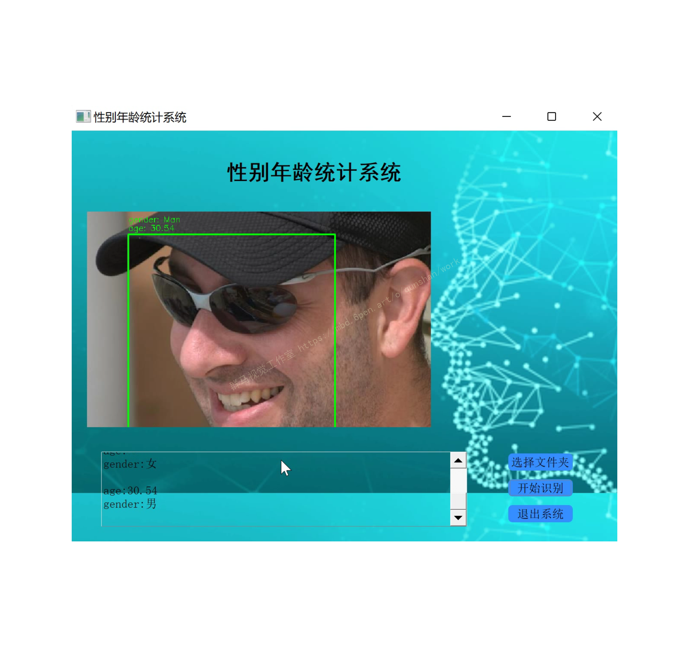
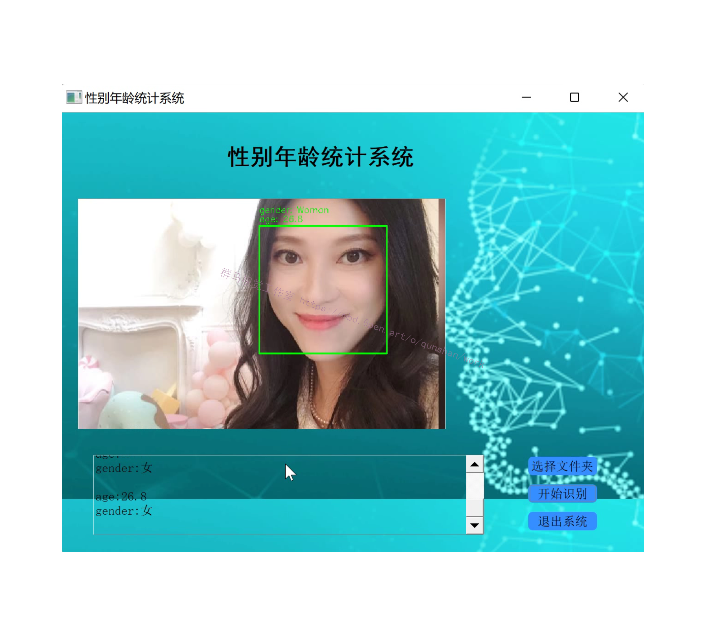
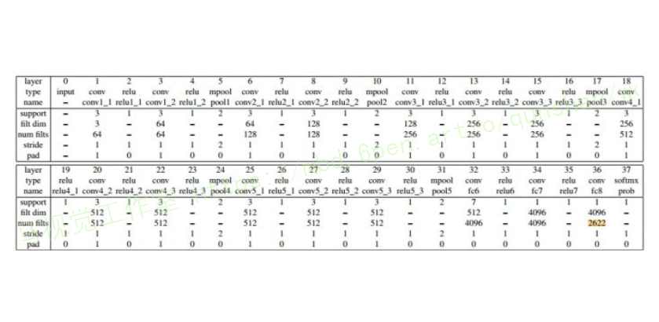
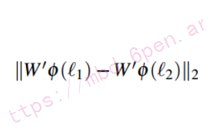
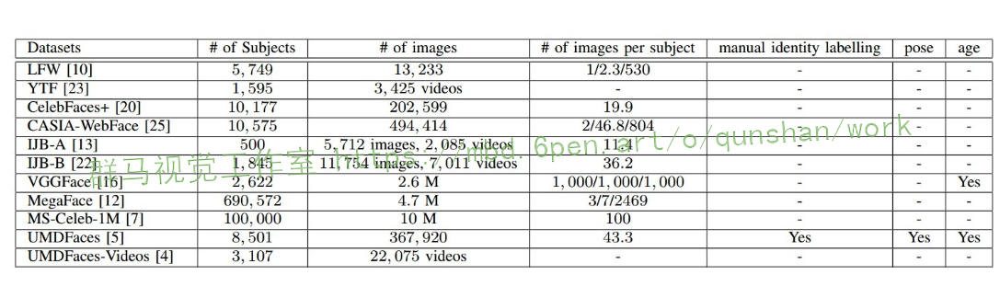

# 1.研究背景
计算机视觉作为计算机学科的一大分支,在近些年的发展十分迅速。图像识别也从最开始进行简单的数字和形状识别发展到了现在对各种复杂物体的识别。其中我们最熟悉的便是计算机对于人脸的识别,近些年大数据和深度学习网络的高速发展,给人脸的识别提供了极佳的发展环境,加上越来越多的开源数据库的成立,对于人脸识别的研究在近几年达到高潮。
人脸年龄识别是人脸识别问题的一个子集,人脸的年龄估计有比较广泛的应用范围,人脸是一个随时间变化的属性,年龄的变化可能会给常规的人脸识别带来误差,增加人脸识别的误识率,这种情况就可以根据年龄估计系统快速对人脸属性进行年龄归类,然后对系统中储存的图像进行年龄修正,允许部分脸部特征的匹配,从而减小年龄的变化对人脸识别的影响。除了图像的跨年龄识别外,图像识别还能应用在人员的快速筛查系统当中,在有大量人员的图像或者视频当中如果想要对人群进行年龄分类的话,如果对所有人的面部特征进行逐一搜索识别然后提取属性信息的话会花费大量的时间代价。如果仅仅对每个人的面部特征进行提取并进行年龄估计的话,便能很快地将人群按年龄分类。

# 2.识别图片




# 3.视频演示
[基于VGGFace2的人脸性别年龄检测系统（源码＆教程）_哔哩哔哩_bilibili](https://www.bilibili.com/video/BV1ee4y1t7qc/?vd_source=bc9aec86d164b67a7004b996143742dc)

# 4.VGGFace简介
#### 主要思想

目标：构建最少的人为干预大规模人脸数据集，使训练的卷积神经网络进行人脸识别，可以与谷歌和Facebook等互联网巨头竞争。并不是用FaceNet那种端到端系统。
人脸分类器：VGGNet+Softmax loss，输出2622个类别概率
三元组学习人脸嵌入：VGGNet+Triplet loss，输出1024维的人脸表示
在人脸分类器基础上，用目标数据集只fine-tuning学习了映射层
人脸验证：通过比较两个人脸嵌入的欧式距离来验证同种人。
构建新的人脸数据集：2622个人，每人1000张，共260万个人脸。
在LFW上的准确率为98.95%，YTF上准确率是97.3%

#### VGGNet网络架构

[参考该博客提出的改进后的VGGNet网络](https://afdian.net/item?plan_id=e41076cc5cc211ed91a552540025c377)比较深，基本和VGGNet一样，又改进了：
1.3x3卷积核，卷积步长为1
2.ReLU激活
3.有3个全连接层
4.没有用local contrast normalization

#### 人脸分类器
1.使用如下VGGNet，训练一个n=2622路的Softmax loss人脸分类器。使用随机高斯初始化，随机梯度下降（批量较大时用Accumulator Descent），Batch Size=256
2.学习完成后，去除分类器层(W,b)，利用欧氏距离比较得分向量，进行人脸识别验证。
3.然而，我们而是通过使用“三元组损失”训练方案对它们进行调优，以便在欧几里德空间中进行验证，可以显著提高分数，下一节将对此进行说明。为了获得良好的整体性能，必须将网络引导为分类器。


#### 三元组学习人脸嵌入
1.三元组损失训练的目的是学习在最终应用中表现良好的分数向量，即通过比较欧几里德空间中的人脸描述符来验证身份。这在本质上类似于“度量学习(metric learning)”，并且像许多度量学习方法一样，它用于学习同时具有独特性和紧凑性的映射，同时实现降维。
2.在进行验证时，分类器在最后一层FC层输出了2622维的特征（即对应每一类的概率），而这里还会被用来以Triplet loss做一个度量学习。度量学习是一个全连接层，使用目标数据集(如LFW和YTF)的训练集部分训练映射函数W'，获得1024维的人脸特征表达（人脸嵌入）。（基于神经网络的人脸验证）
3.同样的网络输入为大小为224×224的人脸图像，后面前两个FC层的输出是4096维的，最后一个FC层后的输出是N=2622维或L=1024维，这取决于用于优化的损失函数是Softmax还是Triplet loss。
注意，与前一节不同的是，这里没有学习到任何偏差，因为三元组损失函数中的差异会抵消它

# 5.人脸验证
通过比较两个1024维人脸特征的欧式距离是否小于阈值来验证



# 6.VGGFace2人脸年龄数据集

[该博客提出的VGGFace2](https://mbd.pub/o/bread/mbd-Y5eYmZds) 是一个大规模人脸识别数据，包含331万图片，9131个ID，平均图片个数为362.6。这个数据集有以下几个特点：
1）人物ID较多，且每个ID包含的图片个数也较多。
2）覆盖大范围的姿态、年龄和种族。
3）尽可能地使噪声最少。
作者使用ResNet-50和SE分别在VGGFace/MSCeleb-1M/VGGFace2分别做训练，使用IJB-A做测试，证明了VGGFace2的最佳训练结果。同时实验也表明，使用MS-Celeb-1M做预训练，再使用VGGFace2做finetune,能够取得更好的效果。
该数据集是从谷歌中下载的，包含不同姿态、年龄、光照和背景的人脸图片，其中约有59.7%的男性。除了身份信息之外，数据集还包括人脸框，5个关键点、以及估计的年龄和姿态。下图为VGGFace2和其它人脸数据集的具体指标对比：


# 7.训练过程
本文使用了ResNet-50和SE-ResNet-50网络分别在VGGFace/VGGFace2/MS-Celeb-1M上进行训练，在IJB-A上进行测试和对比人脸识别性能。实验证明，相同网络在VGGFace2上训练的识别模型在1：1比对和1：N搜索均取得了更好的结果，进一步地，将MS-Celeb-1M和VGGFace2结合，SE-ResNet-50能够取得最佳的识别结果。（实验也证明了SE-ResNet-50的优越性能，需要在自己的实验中应用一下）
体系结构。ResNet-50[8]和SE-ResNet-509作为训练数据集之间比较的主干架构。 Squeeze-and-Excitation（挤压-激励(SE)）block[9]，通过显式地建模通道关系，自适应地重新校准通道方向的特征响应。它们可以与ResNet等现代架构相结合，提高其代表性。这在物体和场景分类中得到了证明，一个挤压-激励网络赢得了ILSVRC 2017分类竞赛。
在四种设置下进行如下实验:(a)在VGGFace16上从零开始学习网络;(b)在MS-Celeb-1M(简称MS1M)[7]上从零开始学习网络;©在VGGFace2(简称VF2)上从零开始学习网络;(d)网络首先在MS1M上进行预先训练，然后在VGGFace2(简称VF2 ft)上进行微调。
我们研究了在VGGFace2上训练的架构的效果(表VI)。ResNet-50和从零开始学习的SENet的对比显示，SENet在验证和识别方面始终具有优越的性能。更重要的是，从零开始训练的SENet取得了与微调ResNet-50(即在MS1M数据集上进行首次预训练)相当的结果，这表明我们的数据集的多样性可以被一个先进的网络进一步利用。此外，通过在两个数据集VGGFace2和MS1M上进行培训，利用每个数据集提供的不同优势，可以进一步提高SENet的性能

# 8.代码实现

```
from __future__ import print_function
import keras
from keras.layers import Input, Dense, Flatten, add
from keras.layers import Conv2D, Activation, MaxPooling2D, AveragePooling2D
from keras import backend as K
from keras.callbacks import ModelCheckpoint
import tensorflow as tf
from keras.models import Model
from keras.utils import plot_model
from sklearn.model_selection import train_test_split
import os
import numpy as np
import cv2
import random
 
# FLAGS参数设置
FLAGS = tf.app.flags.FLAGS
tf.app.flags.DEFINE_string('graph_name', 'vggface2', '模型图片的名字')
# 训练数据路径
tf.app.flags.DEFINE_string('train_path',
                           'E://dataset//vggface2//train',
                           'Filepattern for training data.')
# 测试数据路径
tf.app.flags.DEFINE_string('test_path',
                           'E://dataset//vggface2//test',
                           'Filepattern for testing data.')
tf.app.flags.DEFINE_string('model_path',
                           'modeldir.VGGface',
                           '模型保存路径')
tf.app.flags.DEFINE_integer('height', 190, '')
tf.app.flags.DEFINE_integer('width', 170, '')
tf.app.flags.DEFINE_integer('IMAGE_CHANNELS', 3, '')
tf.app.flags.DEFINE_integer('num_classes', 8631, '类别数')
tf.app.flags.DEFINE_integer('epochs', 9, '训练轮数')
tf.app.flags.DEFINE_integer('batch_size', 4, '')
# 模式：训练、测试
tf.app.flags.DEFINE_string('flag', 'train', 'train or eval.')
 
 
def res_block(x, channels, i):
    if i == 1:  # 第二个block
        strides = (1, 1)
        x_add = x
    else:  # 第一个block
        strides = (2, 2)
        # x_add 是对原输入的bottleneck操作
        x_add = Conv2D(channels,
                       kernel_size=(3, 3),
                       activation='relu',
                       padding='same',
                       strides=strides)(x)
 
    x = Conv2D(channels,
               kernel_size=(3, 3),
               activation='relu',
               padding='same')(x)
    x = Conv2D(channels,
               kernel_size=(3, 3),
               padding='same',
               strides=strides)(x)
    x = add([x, x_add])
    Activation(K.relu)(x)
    return x
 
 
def build_model(input_shape):
    inpt = Input(shape=input_shape)
 
    # conv_1
    x = Conv2D(16,
               kernel_size=(3, 3),
               activation='relu',
               input_shape=input_shape,
               padding='same'
               )(inpt)
 
    # conv_2
    # x = MaxPooling2D(pool_size=(3, 3), strides=(2, 2))(x)
    for i in range(2):
        x = res_block(x, 16, i)
 
    # conv_3
    for i in range(2):
        x = res_block(x, 32, i)
 
    x = AveragePooling2D(pool_size=(7, 7))(x)
    x = Flatten()(x)
    x = Dense(FLAGS.num_classes, activation='softmax')(x)
 
    # Construct the model.
    model = Model(inputs=inpt, outputs=x)
    plot_model(model, to_file='resnet_casiafacev5.png')
    model.compile(loss=keras.losses.categorical_crossentropy,
                  optimizer=keras.optimizers.Adadelta(),
                  metrics=['accuracy'])
    return model
 
 
def read_image():  # (train_imagepath, y_train), (test_imagepath, y_test), (val_imagepath, y_val)
    train_imagepaths = []
    test_imagepaths = []
    val_imagepaths = []  # 8631x20
    train_labels = []
    test_labels = []
    val_labels = []
 
    if FLAGS.flag == "train":
        classes = sorted(os.walk(FLAGS.train_path).__next__()[1])  # list
        for c in classes:
            c_dir = os.path.join(FLAGS.train_path, c)
            walk = os.walk(c_dir).__next__()[2]
            for sample in walk[:20]:  # 000_0.bmp
                if sample.endswith('.jpg'):
                    val_imagepaths.append(os.path.join(c_dir, sample))
                    val_labels.append(int(c[1:]))
            for sample in walk[20:]:
                if sample.endswith('.jpg'):
                    train_imagepaths.append(os.path.join(c_dir, sample))
                    train_labels.append(int(c[1:]))
        # '''使训练集长度为batch size的倍数'''
        # lentrain = len(train_imagepaths)
        # for _ in range(FLAGS.batch_size - lentrain % FLAGS.batch_size):
        #     c = classes[random.randint(0, FLAGS.num_classes)]
        #     c_dir = os.path.join(FLAGS.train_path, c)
        #     sample = os.walk(c_dir).__next__()[2][random.randint(0, )]
        #     train_imagepaths.append(os.path.join(c_dir, sample))
        #     train_labels.append(int(c[1:]))
 
    elif FLAGS.flag == "eval":
        classes = sorted(os.walk(FLAGS.test_path).__next__()[1])  # list
        for c in classes:
            c_dir = os.path.join(FLAGS.test_path, c)
            walk = os.walk(c_dir).__next__()[2]
            for sample in walk[:20]:
                if sample.endswith('.jpg'):
                    test_imagepaths.append(os.path.join(c_dir, sample))
                    test_labels.append(int(c[1:]))
 
    return (train_imagepaths, train_labels), (test_imagepaths, test_labels), (val_imagepaths, val_labels)
 
 
# 读取图片函数
def get_im_cv2(paths):
    images = []
    for path in paths:
        img = cv2.imread(path)
        # Reduce size
        resized = cv2.resize(img, (FLAGS.width, FLAGS.height))
        # normalize:
        resized = resized.astype('float32')
        resized /= 127.5
        resized -= 1.
        images.append(resized)
    images = np.array(images).reshape(len(paths), FLAGS.height, FLAGS.width, FLAGS.IMAGE_CHANNELS)
    images = images.astype('float32')
    return images
 
 
def get_batch(X_path, y_):
    '''
    参数：
        X_path：所有图片路径列表
        y_: 所有图片对应的标签列表
    返回:
        一个generator，x: 获取的批次图片 y: 获取的图片对应的标签
    '''
 
    while 1:  # 如果没有while true的话，在一轮epoch结束后无法继续迭代，第二轮训练之前会遇到StopIteration异常
        for i in range(0, len(X_path), FLAGS.batch_size):
            x = get_im_cv2(X_path[i:i+FLAGS.batch_size])
            y = keras.utils.to_categorical(y_[i:i+FLAGS.batch_size], FLAGS.num_classes)
            # 最重要的就是这个yield，它代表返回，返回以后循环还是会继续，然后再返回。就比如有一个机器一直在作累加运算，
            # 但是会把每次累加中间结果告诉你一样，直到把所有数加完
            yield(np.array(x), np.array(y))
 
 
def train(model, train_imagepath, y_train, val_imagepath, y_val):
    checkpoint = ModelCheckpoint(FLAGS.model_path,
                                 monitor='val_loss',
                                 verbose=1,  # 详细信息模式，0 或者 1 。
                                 save_best_only=True,
                                 save_weights_only=False,
                                 mode='auto',
                                 period=1  # 每个检查点之间的间隔（训练轮数）
                                 )
 
    model.fit_generator(generator=get_batch(train_imagepath, y_train),
                        steps_per_epoch=len(train_imagepath)//FLAGS.batch_size,
                        epochs=FLAGS.epochs,
                        verbose=2,
                        callbacks=[checkpoint],
                        validation_data=get_batch(val_imagepath, y_val),
                        validation_steps=1,  # 设置验证多少次数据后取平均值作为此epoch训练后的效果，val_loss,val_acc的值受这个参数直接影响
                        shuffle=True,
                        max_queue_size=3,
                        workers=1)  # 最多需要启动的进程数量
 
 
def test(model, test_imagepath, y_test):
 
    model.load_weights(FLAGS.model_path)
    model.compile(loss='binary_crossentropy',
                  optimizer='adam',
                  metrics=['accuracy'])
 
    score = model.evaluate_generator(generator=get_batch(test_imagepath, y_test),
                                    verbose=1,
                                    steps=len(test_imagepath) // FLAGS.batch_size)
                                    #
    print('Test loss:', score[0])
    print('Test accuracy:', score[1])
 
 
def main(_):
    input_shape = (FLAGS.height, FLAGS.width, FLAGS.IMAGE_CHANNELS)
    _model = build_model(input_shape)
 
    # the data, split between train and test sets
    (train_imagepaths, y_train), (test_imagepaths, y_test), (val_imagepaths, y_val) = read_image()
 
    if FLAGS.flag == "train":
        train(_model, train_imagepaths, y_train, val_imagepaths, y_val)
    elif FLAGS.flag == "eval":
        test(_model, test_imagepaths, y_test)
 
 
if __name__ == '__main__':
    tf.app.run()
```

# 9.系统整合
下图[源码＆环境部署视频教程＆数据集＆自定义UI界面](https://s.xiaocichang.com/s/cf06c6)

参考博客[《基于VGGFace2的人脸性别年龄检测系统（源码＆教程）》](https://mbd.pub/o/qunma/work)


# 10.参考文献
[1]许亚军,李玮欣.基于Gabor小波变换和神经网络的人脸识别研究[J].中国电子科学研究院学报.2017,(5).534-539,550.
[2]周飞燕,金林鹏,董军.卷积神经网络研究综述[J].计算机学报.2017,(6).1229-1251.DOI:10.11897/SP.J.1016.2017.01229.
[3]杨巨成,刘娜,房珊珊,等.基于深度学习的人脸识别方法研究综述[J].天津科技大学学报.2016,(6).1-10.
[4]葛微,程宇奇,刘春香,等.基于子空间分析的人脸识别方法研究[J].中国光学与应用光学.2009,(5).377-387.
[5]朱小艳,汪晓华.人脸识别的分析与实现[J].商丘职业技术学院学报.2005,(5).25-26.
[6]Agbo-Ajala, Olatunbosun,Viriri, Serestina.Deep learning approach for facial age classification: a survey of the state-of-the-art[J].Artificial Intelligence Review: An International Science and Engineering Journal.2021,54(1).179-213.DOI:10.1007/s10462-020-09855-0.
[7]Rasmus Rothe,Radu Timofte,Luc Van Gool.Deep Expectation of Real and Apparent Age from a Single Image Without Facial Landmarks[J].International Journal of Computer Vision.2018,126(2/4).144-157.DOI:10.1007/s11263-016-0940-3.
[8]Yang, Shuo,Luo, Ping,Loy, Chen Change,等.Faceness-Net: Face Detection through Deep Facial Part Responses.[J].IEEE Transactions on Pattern Analysis & Machine Intelligence.2018,40(8).1845-1859.
[9]Krizhevsky, Alex,Sutskever, Ilya,Hinton, Geoffrey E..ImageNet Classification with Deep Convolutional Neural Networks[J].Communications of the ACM.2017,60(6).
[10]P. Haffner,L. Bottou,Y. Bengio,等.Gradient-based learning applied to document recognition[J].Proceedings of the IEEE.1998,86(11).
[11]Rowley H.A.,Baluja S..Neural network-based face detection[J].IEEE Transactions on Pattern Analysis & Machine Intelligence.1998,20(1).
[12]Stan Z. Li,Long Zhu,Zhen Qiu Zhang,等.Statistical Learning of Multi-view Face Detection[C].2002
[13]Shixing Chen,Caojin Zhang,Ming Dong,等.Using Ranking-CNN for Age Estimation[C].
[14]Szegedy, C.,Wei Liu,Yangqing Jia,等.Going deeper with convolutions[C].
[15]Kaipeng Zhang,Zhanpeng Zhang,Zhifeng Li,等.Joint Face Detection and Alignment Using Multitask Cascaded Convolutional Networks[C].


---
#### 如果您需要更详细的【源码和环境部署教程】，除了通过【系统整合】小节的链接获取之外，还可以通过邮箱以下途径获取:
#### 1.请先在GitHub上为该项目点赞（Star），编辑一封邮件，附上点赞的截图、项目的中文描述概述（About）以及您的用途需求，发送到我们的邮箱
#### sharecode@yeah.net
#### 2.我们收到邮件后会定期根据邮件的接收顺序将【完整源码和环境部署教程】发送到您的邮箱。
#### 【免责声明】本文来源于用户投稿，如果侵犯任何第三方的合法权益，可通过邮箱联系删除。